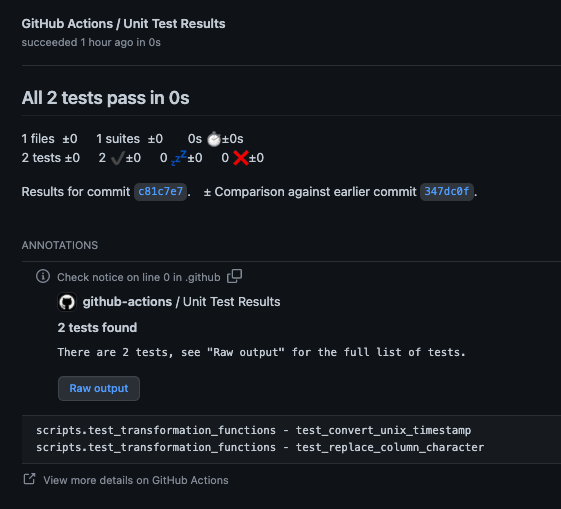
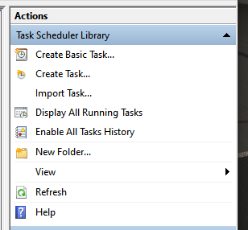
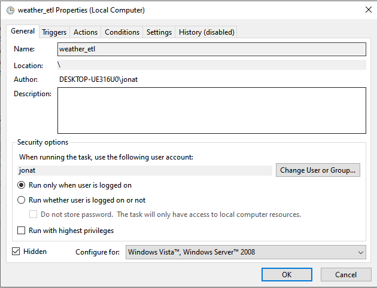

# Purpose and motivation

This is a demonstration repository to help aspiring data engineers understand how ETL works end-to-end. 

CompanyX wishes to analyse historical trends of the weather data. In order to do so, it needs to retrieve and store weather data as frequently as possible (1 minute intervals). 

CompanyX has a data analyst in the business, however they need support in (1) extracting weather from APIs and files, (2) transforming the data so that it is usable for the data analyst, (3) loading the data in a database which can then be queried and connected to by the data analyst. 

This code repository contains the solution to perform the ETL on a scheduled basis, and store the data in a PostgreSQL Database. 

To provide confidence over the transformations applied, unit tests have also been written. Continuous integraiton pipelines has also been configured to automate the testing of code prior to merging to `main`.  

# Repo structure 
```
.github/workflows                           # contains continuous integration pipelines 
data/                                       # contains static datasets 
docs/                                       # contains additional documentation 
images/                                     # contains images used for the README
scripts/    
    |__ credentials.py                      # create your own credentials.py here (already added to .gitignore)
    |__ ddl_create_table.sql                # SQL code used to create the target tables 
    |__ etl.ipynb                           # the python ETL notebook (write your code here)
    |__ etl.py                              # an auto-generated file from the python ETL notebook (do not write your code here)
    |__ run_etl.sh                          # a shell script used to shorten the amount of code needed to be written in cron 
    |__ test_transformation_functions.py    # pytest unit tests 
    |__ transform_functions.py              # custom user-generated transformation functions 
README.md                                   # all you need to know is in here 
requirements.txt                            # python dependencies 
```

# Solution 

## Solution architecture 

The solution architecture diagram was created using: https://draw.io/ 

Icons were taken from: https://www.flaticon.com/ 


The **E**xtract, **T**ransform, and **L**oad steps are explained below. 

<details>
<summary><strong> Extract </strong></summary>

#### Data sources 
Data is extracted from the following data sources. 

| No | Data Source | Description | Source Type | URL | 
| - | - | - |- | - |
| 1 | OpenWeather API | Contains current weather data | REST API | https://openweathermap.org/current (you will need to genereate your key there) | 
| 2 | Australian Capital Cities | Contains names of australian capital cities | CSV | user generated | 

</details>

<details>
<summary><strong> Transform </strong></summary>


The following transformation scripts are executed: 
| Script | Input | Output |  
| - | - |- |
| [etl.ipynb](scripts/etl.ipynb) | [1], [2] | `city`, `temperature`, `atmosphere` | 

The `etl.ipynb` notebook is converted to `etl.py` by running the code below: 
```sh
python -m jupyter nbconvert --to python etl.ipynb
```
</details>


<details>
<summary><strong> Load </strong></summary>


#### Loading process 
Data is loaded into the PostgreSQL using an upsert (insert/update) statement. 

1. Attempt to insert the records 
2. If fail due to records already existing, then update records 

</details>

# ERD and Data Dictionary

### Entity Relationship Diagram 

The ERD diagram was created using: https://app.quickdatabasediagrams.com/#/


The Data Definition Language (DDL) used to create the tables can be found [here](scripts/ddl_create_table.sql). 

### Data dictionary 

Below are the data definitions for the following tables: 

<b>`city`</b>
|Column name| Definition | 
|-|-|
|city_id|The unique id for each city| 
|name| The name of the city |
|coord_lon| The longitude of the city|
|coord_lat| The latitude of the city| 

<b>`temperature`</b>
|Column name| Definition | 
|-|-|
|city_id|The unique id for each city| 
|datetime| The timestamp of when the temperature was taken |
|main_temp| The actual temperature at that time|
|main_feels_like| The temperature it feels  like taking into consideration other factors|
|main_temp_min| The minimum the temperature could be at that point in time|
|main_temp_max| The maximum the temperature could be at that point in time|

<b>`atmosphere`</b>
|Column name| Definition | 
|-|-|
|city_id|The unique id for each city| 
|datetime| The timestamp of when the atmosphere was measured |
|main_pressure| The atmospheric pressure at that point in time|
|main_humidity| The humidity at that point in time|


# Usage 

## Python dependencies 
The required python libraries and version have been specified in [requirements.txt](requirements.txt). 

Install python dependencies by performing : 

```
pip install -r requirements.txt 
```

## Credentials 
In the `script/` folder, create a `credentials.py` file with the following variables:
```py
api_key = "<your_api_key>"                  # open weather API api key 
db_user = "<your_database_user>"            # postgresql username 
db_password = "<your_database_password>"    # postgresql password 
```

These credentials will be used in the `etl.ipynb` notebook. 

The `credentials.py` file is already in .gitignore and thus your credentials will not be stored on Git. 

## Running code locally 
To run the ETL code on your computer, execute the following in your terminal: 

```
cd scripts
python -m jupyter nbconvert --to python scripts/etl.ipynb
python scripts/etl.py
```

## Run unit tests 
To run the unit tests on your computer, execute the following in your terminal: 

```
pytest scripts
```

You should see the following output: 

```
====== test session starts ======
platform darwin -- Python 3.7.11, pytest-6.2.5, py-1.11.0, pluggy-1.0.0
collected 2 items
scripts/test_transformation_functions.py .. [100%]
====== 2 passed in 0.36s ======
```

## Continuous integration 

To ensure that code is tested prior to merging to the `main` branch, an automated Continuous Integration (CI) pipeline has been configured. 

See code [here](.github/workflows/etl-ci.yml). 

The expected output when the CI pipeline runs are: 

1. Successful execution of CI pipeline 


2. All unit tests passed 




## Scheduling jobs 


<details>
<summary><strong> Cron (MacOS or Linux) </strong></summary>

To schedule a job using cron (see full guide [here](https://ole.michelsen.dk/blog/schedule-jobs-with-crontab-on-mac-osx/)): 

```sh 
# open crontab 
env EDITOR=nano crontab -e
# paste the following into crontab
* * * * * cd /Users/jonathanneo/Documents/trilogy/weather-etl/scripts && bash run_etl.sh
# write the file using: CTRL + O
# close the file using: CTRL + X
# check that the cron job has been scheduled - you should see your job appear 
crontab -l 
```

You should see the following output: 
```
(base) Jonathans-MacBook-Pro-2:~ jonathanneo$ crontab -l
* * * * * cd /Users/jonathanneo/Documents/trilogy/weather-etl/scripts && bash run_etl.sh
```

</details>

<details>
<summary><strong> Task Scheduler (Windows) </strong></summary>

1. Open Task Scheduler on windows 

2. Select `Create task`



3. Provide a name for the task 



4. Select `Actions` > `New` 


5. Provide the following details, and click `OK`: 
    - Program/script: `<provide path to your python.exe in your conda environment folder>`
        - Example: `C:\Users\jonat\anaconda3\envs\PythonData\python.exe`
    - Add arguments (optional): `<provide the etl file>`
        - Example: `etl.py` 
    - Start in (optional): `<provide the path to the etl file>` 
        - Example: `C:\Users\jonat\Documents\weather-etl\scripts`


6. Select `Triggers` 


7. Provide details of when you would like the job to run 


8. Click `OK` 

</details>

# Contributors
- [@jonathanneo](https://github.com/jonathanneo)